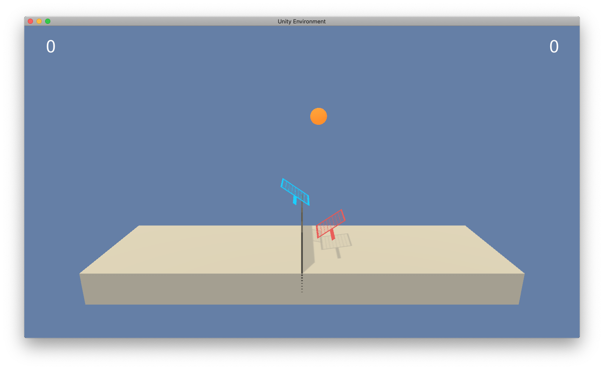
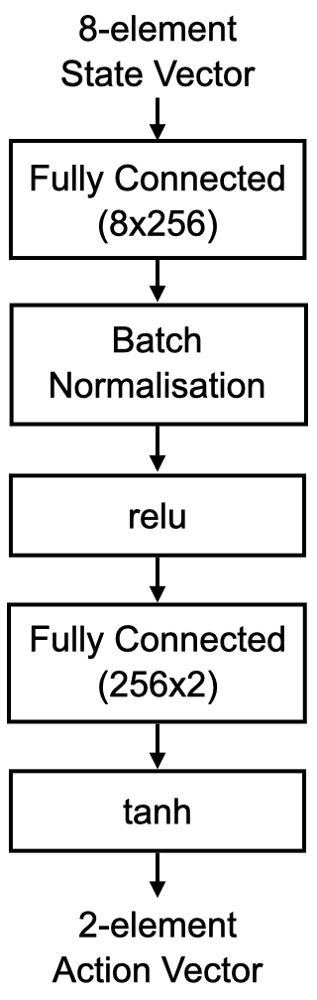
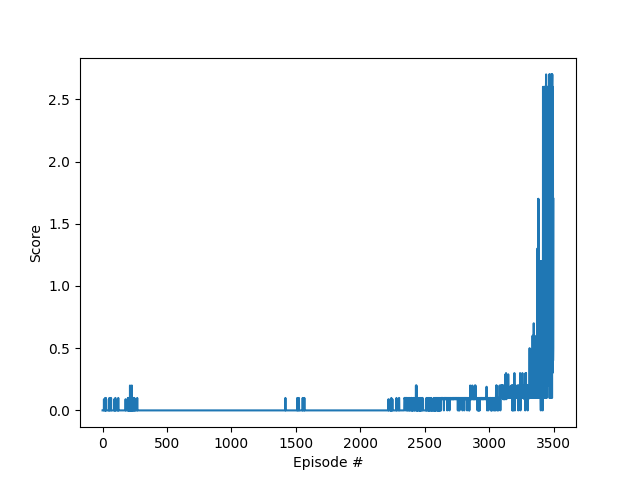

# Project 3. Collaboration and Competition
### Learning Algorithm

TODO: The report clearly describes the learning algorithm, along with the chosen
hyperparameters. It also describes the model architectures for any neural
networks.

### Plot of Rewards

TODO: A plot of rewards per episode is included to illustrate that the agents
get an average score of +0.5 (over 100 consecutive episodes, after taking the
maximum over both agents).

TODO: The submission reports the number of episodes needed to solve the
environment.

### Ideas for Future Work

TODO: The submission has concrete future ideas for improving the agent's
performance.
